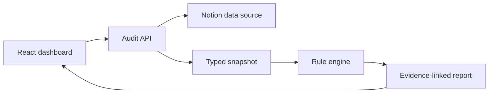

# Notion Data Audit

**A review-only Notion workspace structure auditor.**

Notion Data Audit reads one Notion data source, checks whether its structure is dependable enough for people and AI tools, and explains every issue with concrete evidence. It can preview safe suggestions, but the MVP never writes back automatically.

## The 90-second tour

1. Open the app in **Demo workspace** mode.
2. Click **Run workspace audit**.
3. Filter the report by severity.
4. Select a finding to see the exact evidence and why it matters.
5. Open **Preview safe fix** to inspect a before/after suggestion.
6. Export the report as Markdown.

The included product-roadmap demo intentionally scores **70/100**. That number is calculated from six rule failures and 30 visible deduction points; it is not hard-coded.

## What it checks

| Check | Question | Example evidence |
|---|---|---|
| Clarity | Do properties explain what belongs in them? | `Owner · people · no description` |
| Completeness | Are important workflow values filled in? | `5 of 12 pages have no Owner` |
| Consistency | Do categories accidentally overlap? | `In progress ↔ In-progress` |
| Uniqueness | Can each page be identified safely? | `Mobile onboarding ↔ mobile-onboarding` |
| Freshness | Could old context still look authoritative? | `Last edited more than 90 days ago` |

Each rule creates a typed finding with a rule ID, severity, evidence, human impact, recommendation, and fixed score deduction.

## Product principles

- **Evidence before advice.** Every suggestion says exactly what triggered it.
- **Human before automation.** A person reviews a fix before any future write action.
- **Small permission surface.** Live mode reads one explicitly shared data source.
- **No fake intelligence.** The current score is deterministic and reproducible. Semantic AI checks are a clearly labeled roadmap item.
- **Useful without setup.** The realistic demo path works immediately.

## Architecture



- `components/workspace-proof-app.tsx` — the interactive dashboard and local review flow
- `lib/audit.ts` — pure TypeScript rule engine; no network or UI dependencies
- `lib/notion.ts` — server-only Notion API adapter and data normalization
- `app/api/audit/route.ts` — narrow boundary between the browser and Notion
- `tests/audit-engine.test.mjs` — behavior and score-boundary coverage

The separation is intentional: the same audit engine can inspect demo data, live Notion data, or a future uploaded fixture.

## Run locally

Requirements: Node.js 22.13 or newer.

```bash
git clone https://github.com/jkaral/notion-data-audit.git
cd notion-data-audit
npm ci
npm run dev
```

Open the local URL shown in the terminal. Demo mode needs no account or secrets.

## Connect one real Notion data source

1. Create an internal integration in your Notion workspace.
2. Share only the data source you want to inspect with that integration.
3. Copy the example environment file:

```bash
cp .env.example .env.local
```

4. Add the values below to `.env.local`:

```text
NOTION_API_KEY=your_server_side_token
NOTION_DATA_SOURCE_ID=the_data_source_id
```

5. Restart the development server and choose **Live Notion** in the app.

Never paste a real token into the browser or commit `.env.local`. Notion Data Audit sends the token only from the server to Notion and limits each scan to 500 pages.

## Verify the project

```bash
npm run lint
npm test
```

The test command creates a production build and runs the UI contract tests plus 11 audit-engine tests. GitHub Actions repeats those checks on every push and pull request.

## Current scope

Implemented:

- Responsive, keyboard-friendly audit dashboard
- Real deterministic audit engine with five rule families
- Evidence, impact, recommendations, and score deductions
- Safe before/after previews with local-only approval state
- Markdown report export
- Demo data that works without configuration
- Optional live Notion read path with pagination
- Server-only credentials, error handling, tests, and CI

Deliberately not implemented yet:

- Automatic edits or destructive actions
- OAuth and multi-user accounts
- Saved audit history or team approval workflows
- LLM/embedding-based semantic checks
- Background jobs for workspaces over 500 pages

See [docs/DECISIONS.md](docs/DECISIONS.md) for the tradeoffs behind those boundaries.

## Next experiments

1. Interview three Notion users and compare the findings they consider useful.
2. Add OAuth so a user can choose an allowed data source instead of configuring environment variables.
3. Add an optional semantic check for vague property descriptions, with confidence and source evidence.
4. Store audit history and show whether workspace quality improves over time.
5. Add an explicit, reversible write flow only after the review workflow is validated.

## Resume-ready description

> Built Notion Data Audit, a TypeScript/React auditor that converts Notion data-source schemas and pages into evidence-linked quality findings; designed a deterministic scoring engine, server-side Notion API adapter, safe fix-preview workflow, Markdown export, and automated test/CI coverage.

## License

[MIT](LICENSE)
